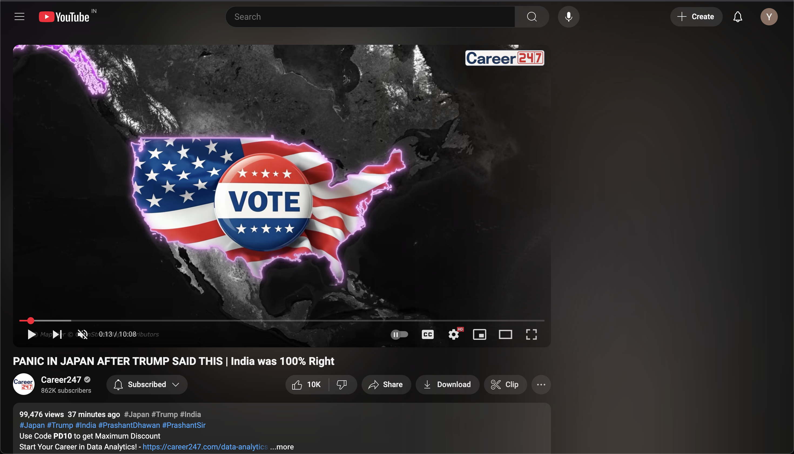

# YouTube Focus - Chrome Extension

A simple Chrome extension to help you stay focused while watching YouTube videos by blurring out suggested videos and preventing accidental clicks.

## Problem
When watching YouTube videos, it's easy to get distracted by suggested videos in the sidebar and end-screens, leading to unintentional clicking and wasting valuable time.

## Solution
This extension:
- Blurs all video suggestions **only when watching a video**
- Disables clicking on suggestions with a "not-allowed" cursor
- Keeps search results and homepages normal for easy navigation
- Includes a simple toggle to enable/disable the feature

## Screenshot

*The extension in action - notice how the video plays normally while suggestions are blurred*

## Installation
1. Download or clone this repository
2. Open Chrome and navigate to `chrome://extensions/`
3. Enable "Developer mode" (toggle in top-right)
4. Click "Load unpacked" and select the extension folder
5. The extension is now active!

## Features
- **Watch-Only Blurring**: Only blurs suggestions when actually watching videos
- **Complete Blocking**: Prevents accidental clicks with cursor disabling
- **Easy Toggle**: Simple on/off toggle in the popup menu
- **Lightweight**: Minimal impact on browser performance

## Files Included
- `manifest.json`: Extension configuration
- `content.js`: Logic for detecting page type and applying filters
- `styles.css`: CSS for blurring suggestions and disabling interaction
- `index.html/js`: Simple interface for toggling the extension
- `icon16/48/128.png`: Extension icons

## Usage
1. Navigate to any YouTube video
2. Suggestions will automatically be blurred
3. Click the extension icon to toggle the feature on/off

## License
Free to use and modify for personal use.
